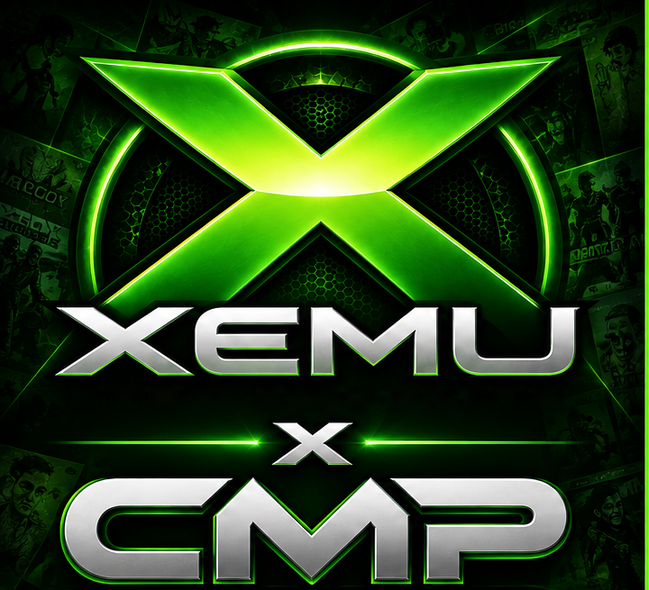
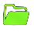
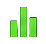
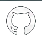

<div align="center">

<!--
  HERO ART:
  Save the standalone generated XEMU × CMP artwork as:
  assets/xemu-x-cmp-hero.png
-->



# XEMU-CHEATDB

### Cheat Codes for the Original Xbox on XEMU

**SAME GAMES. NEW POSSIBILITIES. POWERED BY THE COMMUNITY.**

</div>

---

<table>
<tr>
<td width="33%" valign="top"> <b>CHEAT CODES</b><br>Unlock more from your favorite games.</td>
<td width="33%" valign="top"> <b>DEBUG TOOLS</b><br>Explore. Modify. Customize.</td>
<td width="33%" valign="top"> <b>COMMUNITY DRIVEN</b><br>Built by players, for players.</td>
</tr>
</table>

<div align="center">

**PRESERVE • PLAY • ENHANCE**  
**CLASSIC GAMES. BRIGHTER TOMORROW.**

</div>

---

<table>
<tr>
<td width="66%" valign="top">

## What is XEMU-CHEATDB?

XEMU-CHEATDB is a community-maintained collection of cheat codes for Original Xbox games, designed to work with the **Cheat Engine in XEMU**.

These cheats can unlock hidden content, enable debug features, adjust gameplay, and more helping you get the most out of your favorite classics.

## How to Use Cheats in XEMU

1. Download or copy the game's cheat file (`.txt`) into your XEMU Cheats folder.
2. Launch XEMU and load your game.
3. Open the **Cheat Engine** from the **Debug Tools** menu.
4. Select the cheats you want to enable.
5. Enjoy!

</td>
<td width="34%" valign="top">

###  File Location

Place cheat files (`.txt`) in:

```text
Cheats/
└── cheats.txt
```
```text
Cheats/
└── <File-Replacements>/
       └── <GameID>/
```

Example:

```text
Cheats/cheats.txt
```

###  File Format

All cheat files use the **CMP CodeFormat** (`.txt`).

See the format example below.

</td>
</tr>
</table>

## What Can Cheats Do?

Cheats can be used for many purposes, including:

<table>
<tr>
<td width="33%" valign="top"> <b>Infinite Health</b><br>Never run out of health.</td>
<td width="33%" valign="top"> <b>Max Stats</b><br>Set money, experience, attributes, etc. to maximum.</td>
<td width="33%" valign="top"> <b>Visual Changes</b><br>Change appearances, colors, textures, or other visuals.</td>
</tr>
<tr>
<td valign="top"> <b>Infinite Ammo</b><br>Unlimited weapons or items.</td>
<td valign="top"> <b>Gameplay Mods</b><br>Speed hacks, jump higher, no clip, and more.</td>
<td valign="top"> <b>Unlock Content</b><br>Characters, levels, vehicles, or extras.</td>
</tr>
<tr>
<td valign="top"> <b>Debug Features</b><br>Enable hidden menus, debug modes, or developer options.</td>
<td valign="top"> <b>Custom Cheats</b><br>Community-created codes and unique enhancements.</td>
<td valign="top"> <b>Region / Version Support</b><br>Many games have region-specific codes (USA/EUR/etc.).</td>
</tr>
</table>

## CMP CodeFormat Example

```text
# CMP CodeFormat syntax
!Group Name:
+Code Name
%Credits: Author
$XXXXXXXX YYYYYYYY
!!

# Example
!Player Cheats:
+Infinite Health
%Credits: Community
$0046D784 00000063
!!
```

<table>
<tr>
<td width="65%" valign="top">

###  Notes

- Cheat files are game-specific and region/version sensitive.
- Use cheats at your own risk; some can cause instability in some games.
- This database is maintained by the community.
- If you find a bug or have a new cheat, feel free to contribute.

</td>
<td width="35%" valign="top">

###  Get Involved

Found a new cheat or want to improve an existing one?

Submit a pull request on:

https://github.com/SkillerCMP/XEMU-CHEATDB

</td>
</tr>
</table>

---

<div align="center">

**THANK YOU TO EVERYONE WHO KEEPS THE ORIGINAL XBOX ALIVE!**

<hr>

<div align="center">

<strong>Disclaimer</strong>

<br><br>

XEMU-CHEATDB and CMP are community projects intended for preservation, research, modification, and enhancement of legally obtained software.<br>
We do not condone, support, or endorse piracy or the unauthorized distribution of copyrighted material.

</div>


</div>
